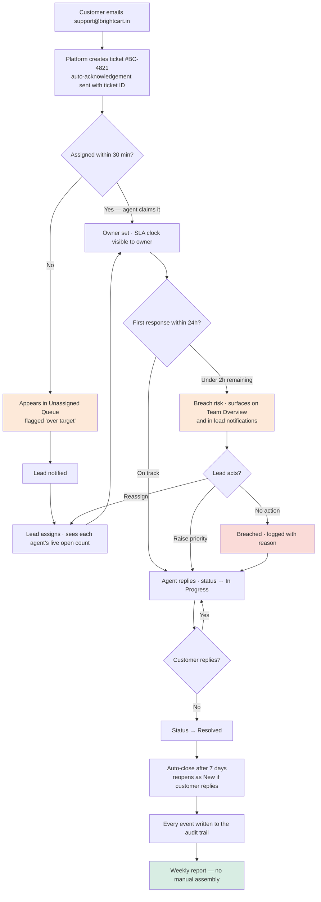
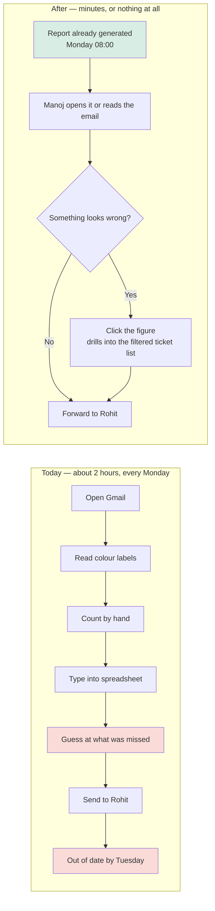
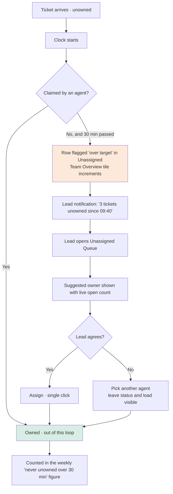
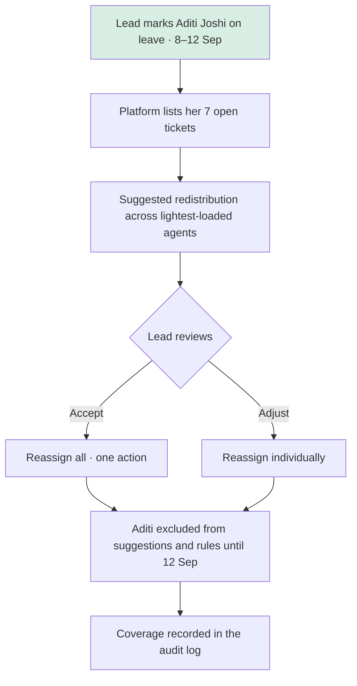

# Workflows — Support Lead (Manoj)

Four flows. The first is the one to present; the other three are the ones that get asked about.

A note on what these are for: the agent flow is a task flow — Priya starts, does a thing, finishes. The lead's flows are not like that. Manoj never starts a ticket and rarely finishes one; he intervenes. So these are drawn as the system running continuously with the lead's decision points marked on it, rather than as a person walking through screens.

---

## 1 · Ticket lifecycle, with the lead's intervention points

The spine of the product. Everything in Manoj's tab is one of the diamonds.

**The three lead intervention points, and the pain each one closes**

| Point | Manoj's own words | What the platform does |
|---|---|---|
| Unassigned over 30 min | *"nobody knows who is handling what"* · *"we shout on floor: anyone on the Sharma refund?"* | Surfaces it with a suggested owner and a live load count |
| Breach risk under 2h | *"urgent ones look same as normal ones. no way to know"* | Ranks by time remaining, not by arrival order |
| Every state change | *"big order issue, management asks who touched this, i have no answer"* | Writes an immutable event with before/after values |

---

## 2 · The Monday report — today, and after

The clearest before-and-after in the whole project, and the one worth showing a client.

The design decision worth defending: **every figure on the report is a link into the tickets behind it.** A report that cannot be interrogated becomes a number that gets argued about — which is the state Brightcart is already in, since the current report is a hand-typed count nobody can check.

---

## 3 · Nothing unowned for more than 30 minutes

The first success criterion, drawn as the loop that enforces it.

**Why there is no auto-assign in v1.** The platform has everything it needs to assign automatically, and it deliberately doesn't. Manoj knows that Meera is on a call with a supplier and Faisal is halfway through a chargeback — a load count does not. Auto-assignment before anyone trusts the numbers means the team spends month one undoing the rules. Tagged Should, planned for after a month of real data.

---

## 4 · An agent goes on leave

Short flow, but it is the one Manoj described with a real casualty.

Without this screen the failure is not silent — Team Overview shows an agent with untouched tickets ageing within a day. That is why it is a Should, not a Must: the safety net exists, this makes it one action instead of seven.
